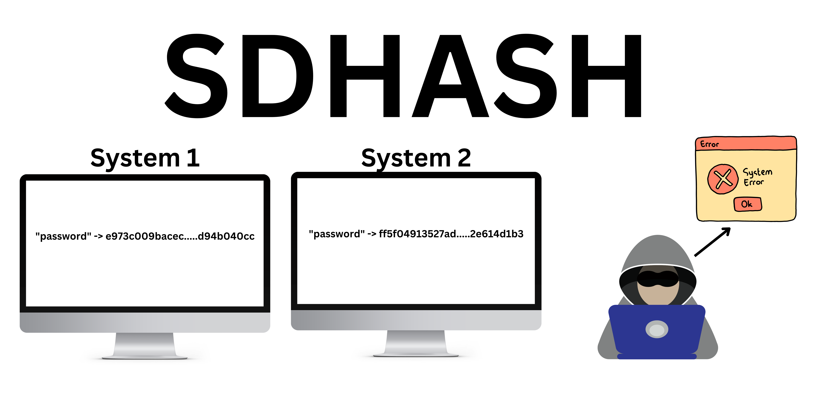

# TrazHash

## Description

TrazHash is a Python library designed to hash data strings or file contents using a combination of your system's specific values and cryptographic hash functions. By incorporating system-specific values such as the system name, node name, release, version, machine, processor, and hostname into the hashing process, the library produces hashes that are tied to the particular system on which the hashing was performed. This can be useful for generating unique identifiers, checksums, or verifying the integrity and origin of data.

The library supports multiple levels of hashing (e.g., hash inside another hash) and allows users to specify the desired cryptographic hash functions (e.g., SHA256, SHA512) for each level.

TrazHash is easy to use, highly configurable, and can be integrated into various Python projects including security applications, data verification tools, and more.

## Features

- **System-specific Hashing**: Combines data strings or file contents with system-specific values before hashing, ensuring that hashes are unique to the system.
- **Multi-level Hashing**: Supports hashing data inside another hash, which can be used for additional security and integrity assurance.
- **Configurable Hash Algorithms**: Allows users to specify which cryptographic hash functions to use at each level.
- **File Hashing**: Conveniently hash the contents of a file.
- **Data Verification**: Includes a function for verifying if the hash of a given data string matches a provided hash.
- **Custom Exceptions**: Provides custom exceptions for error handling, particularly when reading files.

## Use Cases

- **Security Applications**: Produce system-tied hashes for secure authentication or encryption processes.
- **Data Integrity Checks**: Verify the integrity and origin of data by comparing hashes.
- **Unique Identifier Generation**: Generate unique identifiers for data that are also tied to the system.
- **Checksum Generation**: Create checksums for files which are unique to the system for verification purposes.

## Example Use Case

TrazHash can be particularly useful in scenarios where you want to ensure that certain data or files have not been altered or tampered with, and also verify that they originated from a specific system. For instance, in a network of devices where each device generates data files, you can use TrazHash to generate a checksum for each file which includes system-specific values. When collecting data from the devices, you can verify not only that the file has not been altered (by comparing checksums) but also confirm which device the data originated from.

## Disclaimer

Please note that while the library provides cryptographic hash functions, it should not be solely relied upon for security-critical applications without additional safeguards and considerations of the security context in which it is used.